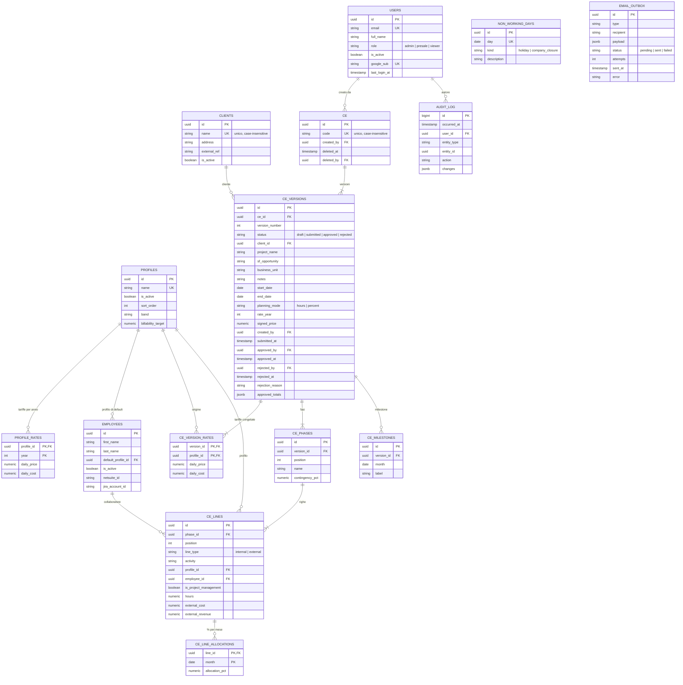

# Modello dati

Schema PostgreSQL gestito con Alembic (`backend/migrations`). I modelli SQLAlchemy sono in `backend/app/models`.

## Convenzioni
- Chiavi primarie UUID generate dal database (`gen_random_uuid()`); eccezione: `audit_log` (intero progressivo) e le tabelle con chiave composta naturale (`profile_rates`, `ce_version_rates`, `ce_line_allocations`).
- `created_at` / `updated_at` in UTC (`timestamptz`) su tutte le tabelle tranne `audit_log`.
- Importi `NUMERIC(14,2)`, percentuali `NUMERIC(5,2)` (0-100), ore `NUMERIC(10,2)`.
- Stati e tipi sono testo con vincolo `CHECK` (più semplice da evolvere degli enum nativi).
- Vincoli e indici hanno nomi deterministici (`pk_`, `fk_`, `uq_`, `ck_`, `ix_`).
- Nessuna cancellazione fisica di dati in uso: chiavi esterne `RESTRICT`; i CE si cancellano logicamente (`deleted_at`). Il contenuto di una versione (fasi, righe, allocazioni, milestone, tariffe) si elimina a cascata con la versione.

## Diagramma ER

## Regole imposte dal database

| Regola | Vincolo |
|---|---|
| Ruolo utente tra admin, presale, viewer | `ck_users_role_valid` |
| Email utente minuscola e unica | `ck_users_email_lowercase`, `uq_users_email` |
| Nome cliente e codice CE unici senza distinzione di maiuscole | `uq_clients_name_lower`, `uq_ce_code_lower` |
| Una tariffa per profilo e anno; importi non negativi | `pk_profile_rates`, `ck_profile_rates_*` |
| Data fine ≥ data inizio | `ck_ce_versions_dates_ordered` |
| Stato e modalità di pianificazione validi | `ck_ce_versions_status_valid`, `..._planning_mode_valid` |
| Versione approvata: approvatore, data e totali obbligatori | `ck_ce_versions_approved_fields` |
| Versione rifiutata: chi e quando obbligatori | `ck_ce_versions_rejected_fields` |
| Numero versione unico per CE | `uq_ce_versions_ce_id_version_number` |
| **Una sola versione non approvata per CE** | `uq_ce_versions_one_open` (indice univoco parziale) |
| Contingency tra 0 e 100 | `ck_ce_phases_contingency_range` |
| Riga interna: profilo obbligatorio, nessun costo/ricavo esterno | `ck_ce_lines_line_shape` |
| Riga esterna: nessun profilo, collaboratore, ore o flag PM; costo e ricavo obbligatori | `ck_ce_lines_line_shape` |
| Allocazione tra 0 e 100%, una per riga e mese | `ck_ce_line_allocations_allocation_pct_range`, `pk_ce_line_allocations` |
| Mesi di allocazioni e milestone sempre al primo giorno | `ck_..._month_first_day` |

Le regole che coinvolgono più tabelle (es. "le ore si usano solo se il CE è in modalità ore", "durata massima 12 mesi", "una versione approvata non si modifica") sono applicate dal backend (Step 5) e coperte da test.

## Ricerca
Estensione `pg_trgm` con indici GIN su `ce.code`, `ce_versions.project_name` e `clients.name` per la ricerca parziale (`ILIKE '%testo%'`); indici su stato e date.

> **Nota Cloud SQL (Step 9):** `CREATE EXTENSION pg_trgm` richiede un utente con privilegi sufficienti (es. l'utente `postgres` di Cloud SQL). La migrazione iniziale la esegue con `IF NOT EXISTS`.

## Dati iniziali
`make seed` carica (senza duplicare né sovrascrivere modifiche dell'admin): 8 profili con tariffe 2026 dal foglio "EC - COSTO AZIENDALE" (esclusi "Esterni" e le bande), e le festività nazionali 2026-2027 più Sant'Ambrogio. Le chiusure aziendali si inseriscono da interfaccia admin.

## Evolvere lo schema
1. Modifica i modelli in `backend/app/models`.
2. `make migration m="descrizione"` e **rivedi sempre** il file generato in `backend/migrations/versions`.
3. `make test`: il test `test_models_and_migration_are_in_sync` fallisce se modelli e migrazioni divergono.

## Evoluzioni previste (migrazione `0002`, Step 5)

Le decisioni prese confrontando il modello con il foglio reale richiedono queste modifiche (nessun dato di produzione da migrare):

- **`ce_version_months`** (nuova): `version_id`, `month` (primo del mese), `non_working_days` (intero ≥ 0, ≤ giorni feriali del mese); unica per (versione, mese). Giorni non lavorativi inseriti a mano per mese, come nel foglio; precompilata dal calendario generale, congelata nella versione.
- **`profiles.is_external`** (boolean, default falso): il profilo **Esterni** (seed: 750 / 360 al giorno per il 2026) è un normale profilo del listino con questo indicatore.
- **`ce_versions.max_discount_pct`** (`NUMERIC(5,2)`, 0-100, default 0): max sconto inserito da chi compila.
- **`ce_lines`**: eliminati `line_type`, `external_cost`, `external_revenue` e il vincolo `line_shape` (i servizi esterni usano il profilo Esterni con ore); restano ore **oppure** allocazioni mensili.
- Il motore di calcolo (`app/engine`) non dipende dal database e riceve questi dati come ingresso.
